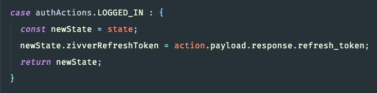
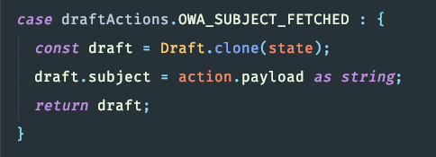

footer: © [@michahell](https://www.twitter.com/michahell) @ [ZIVVER](https://www.zivver.eu)
slidenumbers: true
build-lists: true
theme: Next, 1

[.text-emphasis: scale(3.0), alignment(center)]

# bad parts


---

# bad parts

### - view encapsulation
### - ngFor + list updates
### - custom form components
### - ngIf, ngFor, ngLet?
### - state management


---

# [fit] view encapsulation

---

# [fit] view encapsulation

- overwriting 3rd party styles
- Angular Material specifically

---

# \*ngFor list updates

- finished with MWE and... it just works ¯\\_(ツ)_/¯
- tried to reproduce bug we encountered in OWA but.. no
- anyway
- when you use ngFor, irregardless of changeStrategy used
- you can run into **Angular does not render updates** -issues
- **[⚡ stackBlitz](https://stackblitz.com/edit/ngfor-list-updates)**

---

# [fit] custom
# [fit] form
# [fit] components


---

# [fit] custom form components

__the bad__
- underdocumented
- uses multiple interfaces, classes and styles
- ``` formControlName !== formcontrolname ```

^ - documentation: not up to date.
- Form API exists of lots of stuff.
- lots of ids, refererences passed as strings.
- READ: especially the last two are important to read about.

__read about__
- **Reactive forms** (programmatic) *vs* **template-driven** (angularJs style) forms
- **FormControl**, **FormGroup**, **FormArray** and **Validator**s
- **ControlValueAccessor**
- **MatFormFieldControl**

---

# [fit] ngIf
# [fit] ngFor
# [fit] ngLet?
# [fit] .......it be


---

# [fit] ngIf, ngFor | asyc... ngLet ?

__the good__
- **| async** makes it easy to use observables
- **Store.select()** = not a problem: **ReplaySubject**
- [⚡ stackBlitz](https://stackblitz.com/edit/ngif-ngfor-async)

__the bad__
- **DRY**: [issue](https://github.com/angular/angular/issues/15280), [another issue](https://github.com/angular/angular/issues/2451#issuecomment-330158965)
- not **Store.select()**? multiple (unicast) subscriptions

**possible solution**:
- [NGRX utils ngLet](https://github.com/ngrx-utils/ngrx-utils#nglet-directive)
- [⚡ stackBlitz](https://stackblitz.com/edit/nglet-async)
- (PROD-1196-owa-send-flow-improvements) ✅🚀🔥🙂

---

# [fit] state
# [fit] management
# [fit] [NGRX]
# [fit] + component
# [fit] lifecycle


---

# state management (NGRX)

- encapsulation vs. everything redux ❓
- **do** s
- **don't** tsss...smh
- **caveats**

---

# [fit] state management (NGRX) DOs

- immutability
- think out: Action / reducer / effect
 - for single items
 - or for list of items

---

# state management (NGRX)





- **{...}** or **[state].map(i => new Item(i))** (deep clone!)

---

# [fit] state management (NGRX) DONTs

- don't dispatch multiple actions and assume synchrononicity
- **don't write ALL business logic in @Effects** 
- don't dispatch Actions from @Effects in **tap()** operators. Because, from least bad to horribad:
 - CPU spike
 - memory leaks
 - loops
 - deadlocks

^1) Needs example: asynchronicity due to Effects
3) Try as much as you can to put business logic in services. Reusable, easier to test. use service methods in @Effects.
4) Unpredictability
- CPU: due to large amounts of Actions being dispatched
- memleaks: uncompleted Observables
- loops: chain loops
- deadlocks: ?

---

# [fit] state management (NGRX) caveats

- write silent failing code.
- [completion and **.catchError()** in @Effects](https://github.com/ngrx/platform/issues/1364)
- [RXJS error handling](https://blog.angular-university.io/rxjs-error-handling/)

^Easy to do this. examples: 1) Action does not get dispatched anymore 2) .catchError in main @Effect pipeline 3) observable completes while it should not (first, take, until)

---

# component lifecycle (NGRX)

- dumb components, smart components ✅
- dumb component: gets only **@Input**'s and **Output()**s
- (parent) smart component: knows about **store.select()**


