footer: © [@michahell](https://www.twitter.com/michahell) @ [ZIVVER](https://www.zivver.eu)
slidenumbers: true
build-lists: true
theme: Next, 1

[.text-emphasis: scale(3.0), alignment(center)]

# good parts


---

# good parts

### - **TypeScript**
### - **app component tree**
### - **modules (root, features)**
### - **JIT / AOT**
### - **change strategies**
### - **animations**
### - **ng-container, if #else**
### - **transclusion**

#### - **decorators**
#### - **marble testing**

---

# good parts

### - reactive forms
### - view encapsulation
### - guards, interceptors

### - unit testing
### - observables (RXJS)
### - state management (NGRX)


---

# reactive forms


---

[.code: Fira Code, line-height(1.2)]

# reactive forms

- opposed to *template-driven forms*
- still requires template bindings
- but forms can be tested **without** needing the template
- create forms dynamically (easier), think specials ([Angular example](https://stackblitz.com/angular/pmkbjmxroka?file=src%2Fapp%2Fdynamic-form-question.component.ts))
- does **Angular**, or do **you** create and manage **form** and **form controls** ?

---

[.code: Fira Code, line-height(1.2)]

# reactive forms

reactive:

```html
<input type="text" [formControl]="name">
```

template-driven: 

```html
<input type="text" [(ngModel)]="model.name">
```

---

[.code: Fira Code, line-height(1.2)]

# reactive forms

```TS
new FormControl(
  { value: 'defaultValue', disabled: false },
  [
  	Validators.required,
  	Validators.requiredTrue,
  	Validators.min(2),
  	Validators.max(10),
  	Validators.minLength(2),
    Validators.maxLength(10),
    Validators.email,
    Validators.pattern(/[a-z]/),
    complexCustomValidator
  ]
)

// setting validators at a later time, sync:
formControl.setValidators(syncValidator)

// async:
formControl.setAsyncValidators(asyncValidator)
```

---

# reactive forms

- [angular documentation](https://angular.io/guide/reactive-forms)
- [reactive forms (custom) validators](https://medium.freecodecamp.org/validating-reactive-forms-with-default-and-custom-form-field-validators-in-angular-5586dc51c4ae)

---

# [fit] view encapsulation


---

# view encapsulation

- VE in Angular ([pascal precht](https://blog.thoughtram.io/angular/2015/06/29/shadow-dom-strategies-in-angular2.html))
- ViewEncapsulation.**None**
- ViewEncapsulation.**Emulated** (default)
- ViewEncapsulation.**Native**
- **/deep/, >>>, and ::ng-deep** [(deprecated)](https://angular.io/guide/component-styles#deprecated-deep--and-ng-deep)
- Angular Material about [styling other components](https://material.angular.io/guide/customizing-component-styles)

---

[.code: Fira Code, line-height(1.2)]

# view encapsulation

### my code works. I don't know why

- **[⚡ stackBlitz](https://stackblitz.com/edit/view-encapsulation-one)** <- don't click. everything just works


---

# [fit] guards, interceptors


---

# guards

- comparable to the AngularJs **resolve** route guard
- authentication
- guaranteeing resources exist
- check for supported browser features
- [angular docs route guards](https://angular.io/guide/router#milestone-5-route-guards)
- [protecting routes using guards](https://blog.thoughtram.io/angular/2016/07/18/guards-in-angular-2.html)

---

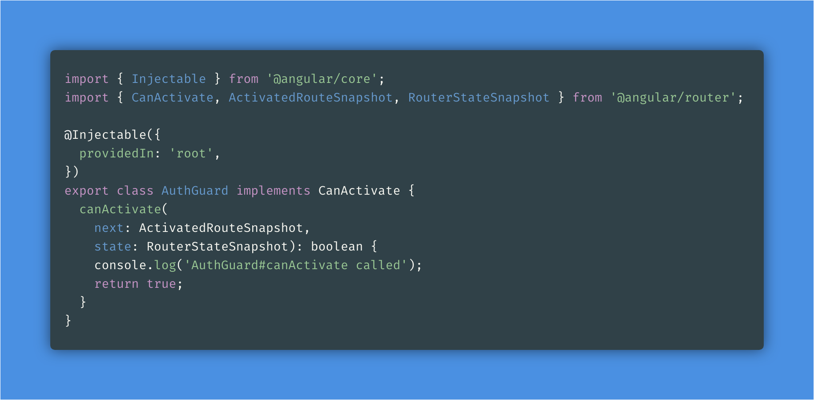

---

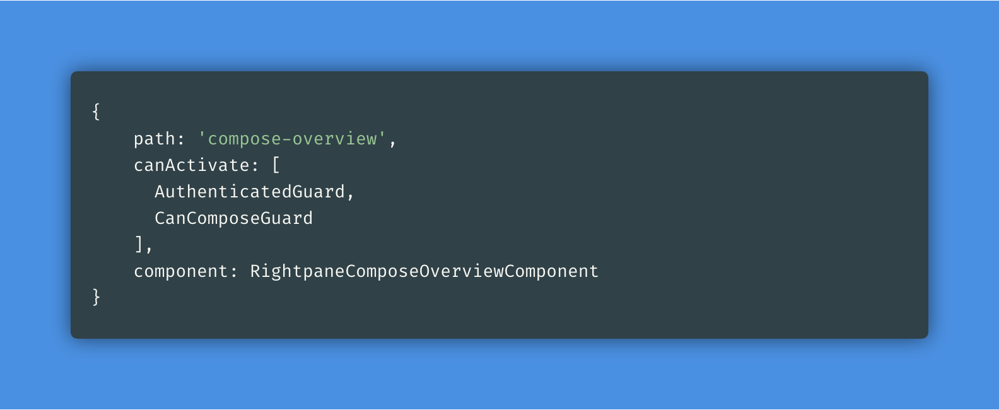

---

# interceptors

- used to exist in AngularJs
- came back in Angular 4.3
- intercept any or all Angular HTTP requests*
- authentication
- retrying
- [httpclient interceptors](https://alligator.io/angular/httpclient-interceptors/)

^* **only Angular requests**
so if you use a third party library, like OfficeJs, and it does it's own requests, those are NOT intercepted.


<!--  -->

---

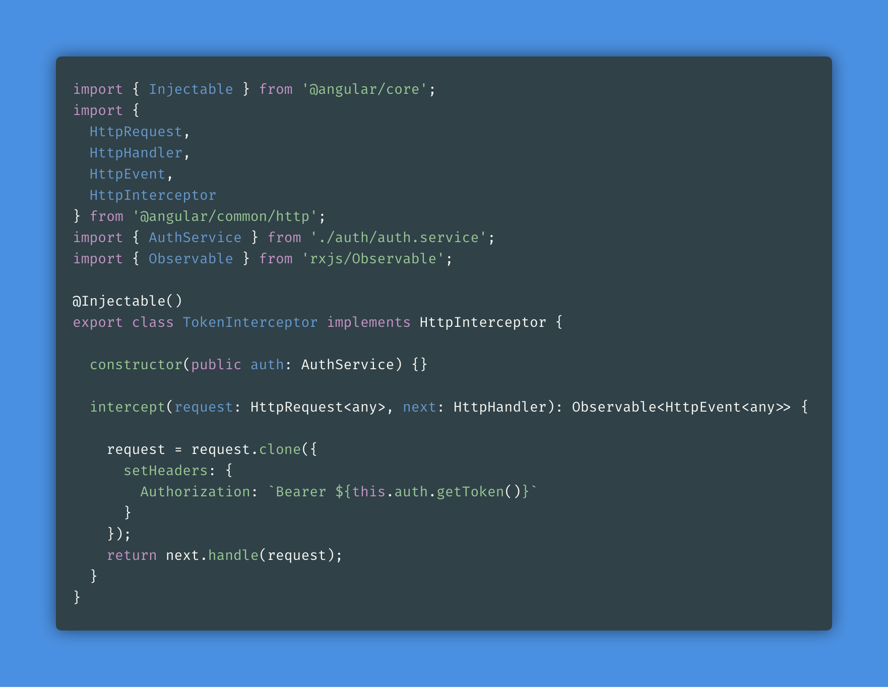

---

# unit testing


---

# unit testing in general

- clear way of setting up tests
- documentation is good
- easy to mock dependencies (w/ useClass + useValue)
- shallow testing with **NO-ERROR-SCHEMA**
- easy to test: services, reducers, guards, interceptors
- ok: components
- harder: components, directives (hosts), @effects

^services, reducers easy to test and contain lots of business logic. then, Effects, then shallow components.

---

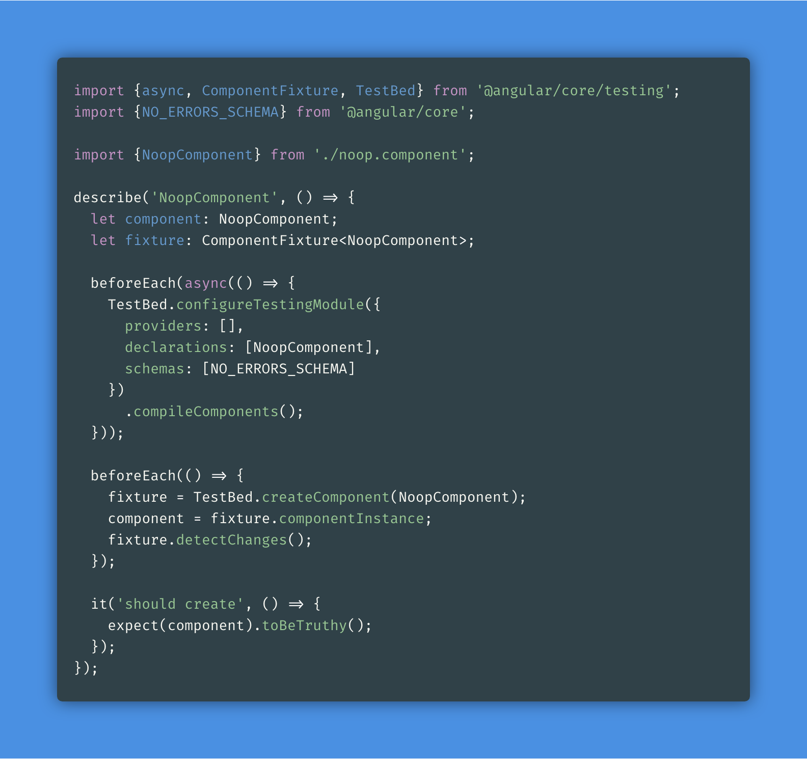

---

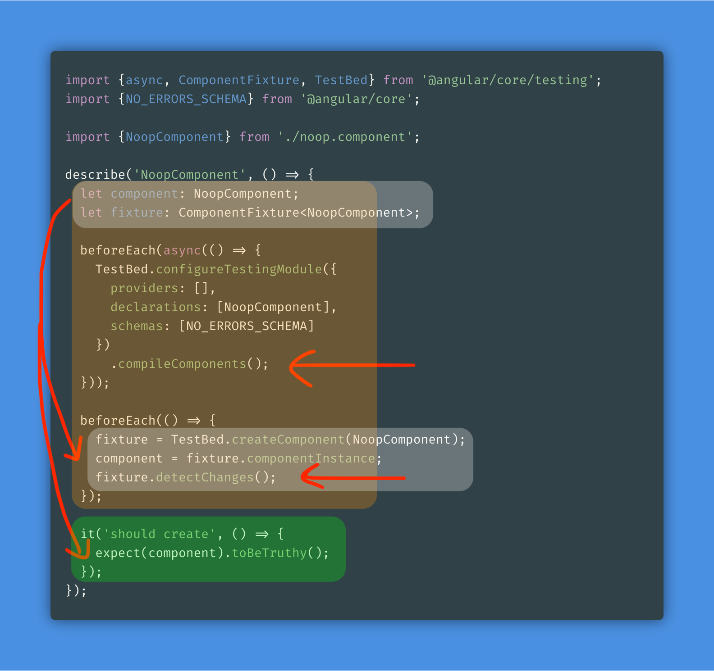

---

### more elaborate component
### (not even that much deps...)

---

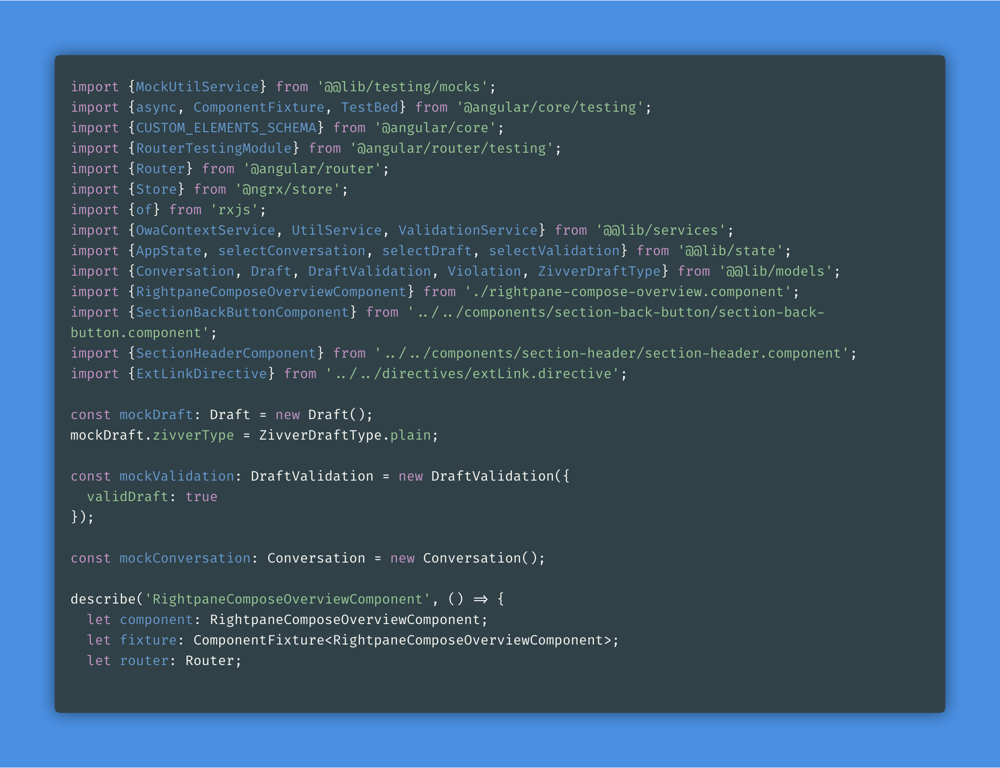

---

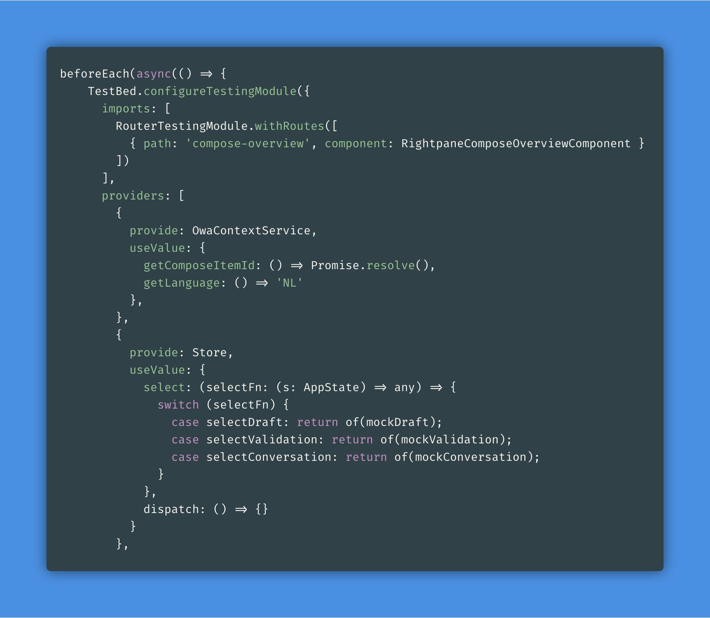

---

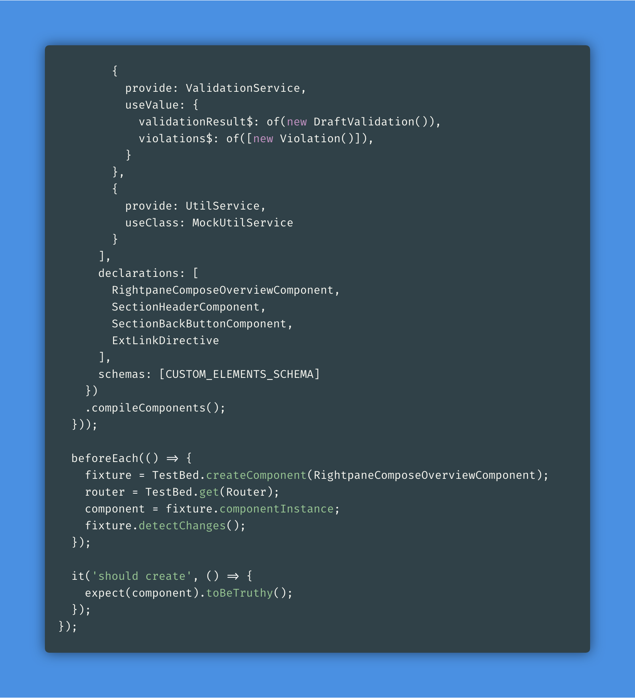

---

# abstract boilerplate away

- have a default **TestBed**, everything dep mocked
- **.override()** deps you need

---

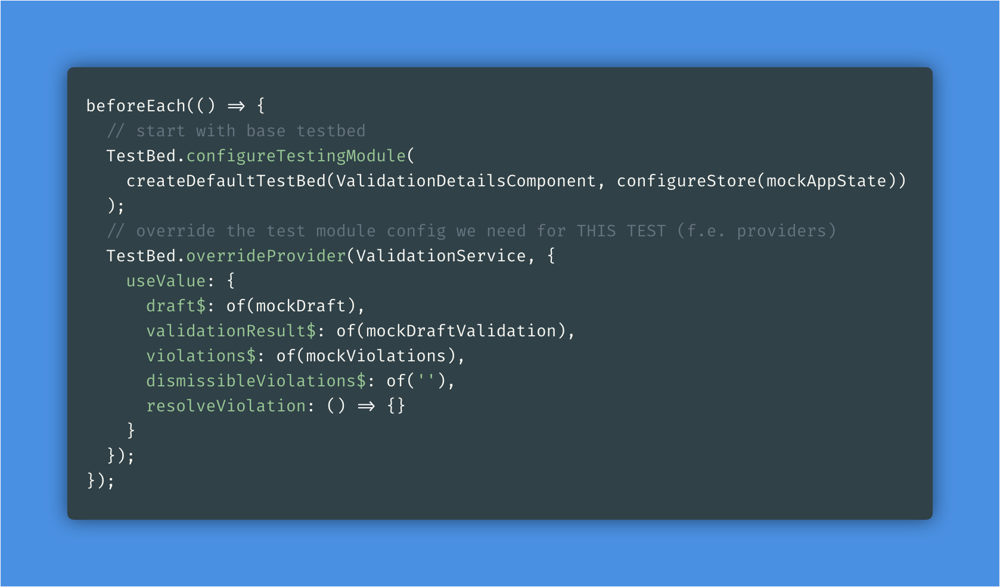

---

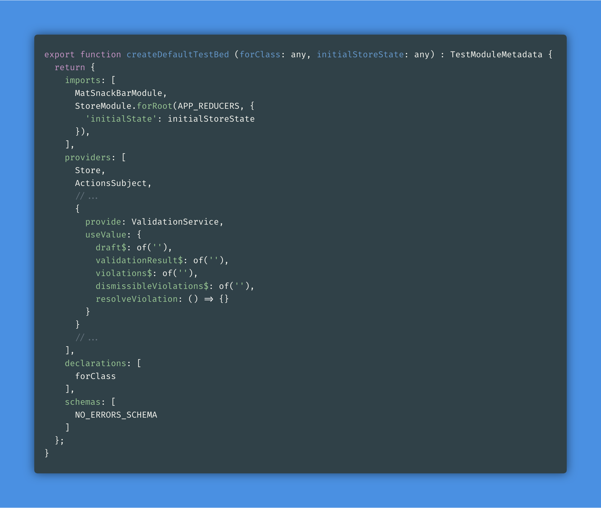

---

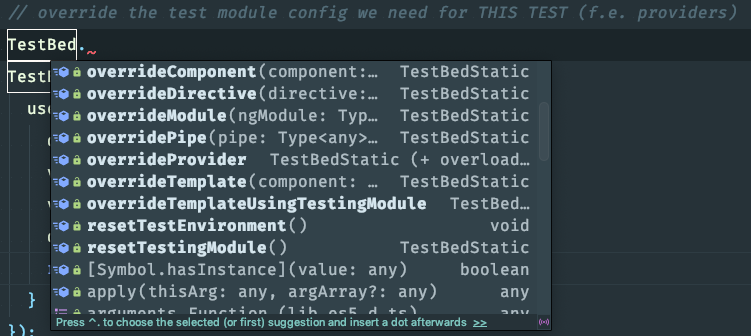

---

# testing components

- component class (w/o tmpl)
- shallow testing (w/ tmpl + shallow)
- integration testing (w/ tmpl)

[three ways of testing](https://vsavkin.com/three-ways-to-test-angular-2-components-dcea8e90bd8d)

^want to go over this quick because it helps determining what you actually want to test.

---

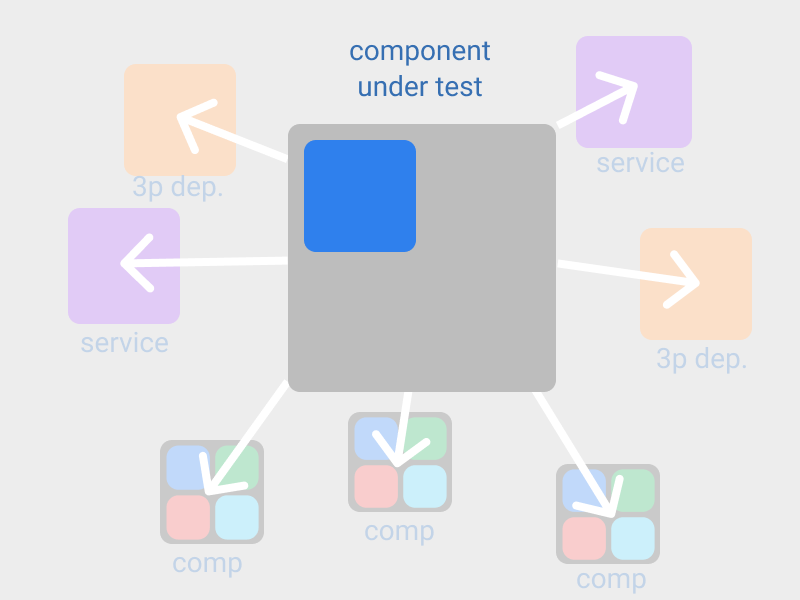

^**component class**
- when?
- only instantiate the component class itself
- to test local logic (smart / no redux-like state mgmt)

---

```TS
const c = new ComposeComponent(<any>route, time, actions);

// performing an action
c.form.setValue({
  title: 'Categorical Imperative vs Utilitarianism',
  body: 'What is more practical in day-to-day life?'
});
c.onSubmit();

// reading the emitted value from the subject
// to make sure it matches our expectations
expect(actions.value.conversationId).toEqual(11);
```

---

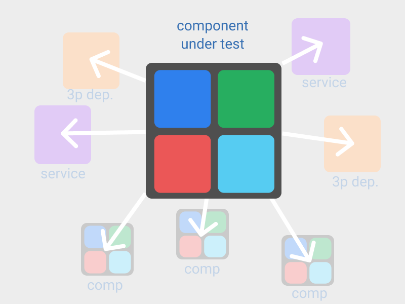

^**shallow testing**
- schemas: [ **NO\_ERRORS\_SCHEMA** ]
- when?
- make sure UI elements are visible
- have the correct state (enabled / disabled)
- basic behaviour

^Did you ever think about why the test is called .spec?
All unit tests in OWA are **Shallow tests**.

---

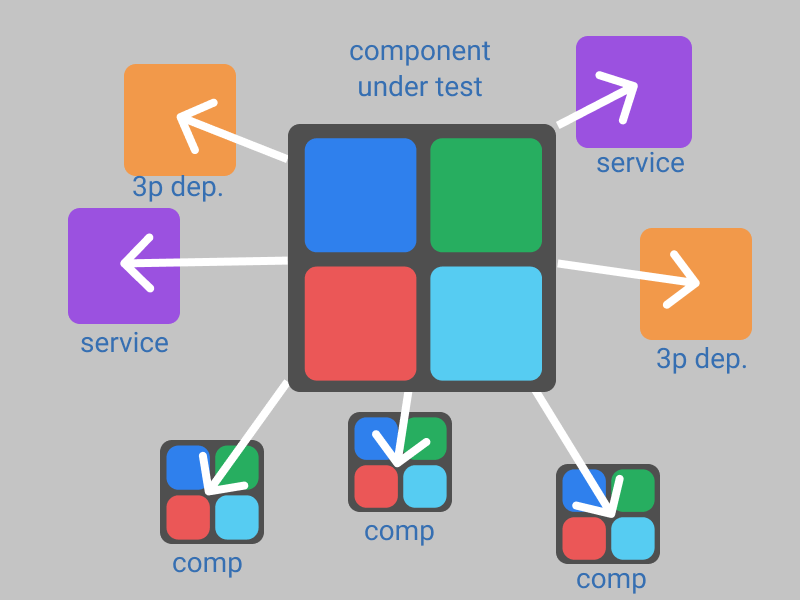

^**integration testing**
- default when using Angular CLI because no schema
- when?
- test component ánd integration with 3p. deps / services
- + all of shallow testing

---

# mocking dependencies

3 ways of mocking dependencies:

- **useValue**:

```TS
provide: RealService,
useValue: {
	realMethodName : () => 'fakeResult';
}
```

- **useClass**:

```TS
provide: RealService, useClass: MockRealService
```

- use realService**.spyOn()** without **.callthrough()**

---

# unit testing caveats

- correct return types in mocked methods!
- don't use global methods/functions -> Services
- it used to be easier to not mock the **Store** and just populate it with mock data
- [but now, it should be mocked](https://ngrx.io/guide/store/testing)... when *shallow testing*


^2) global methods harder to test / mock. General advice is to put them in services. in OWA -> UtilService

---

# worth looking at

- auto mocking libraries
- model mock data generators
- **[Spectator](https://engineering.datorama.com/spectator-for-angular-or-how-i-learned-to-stop-worrying-and-love-the-spec-2aa8521c8488)**
- mostly just a wrapper library
- reduces boilerplate, like CodeceptJs for e2e tests: cleaner syntax

^**auto mocking libraries** Alwin -> library.

---

# observables

### - observable or promise?
### - .pipe() or subscribe()?
### - pipe() + tap() or new obs$?
### - observable lifetime
### - hot vs cold, unicast vs multicast
### - pro's and cons


---

# observable or promise?

- **promise**: one-off, eager, not cancelable
- **observable**: multiple emits, lazy, **cancelable**
- handler functions: [promise -> async, Obs -> sync.](https://itnext.io/javascript-promises-vs-rxjs-observables-de5309583ca2)
- promise -> observable : **from(promise);**
- observable -> promise : **observable.toPromise();**
- some operators accept **Promise**s directly


---

# [fit] .pipe(code) or subscribe(code)?

- .subscribe(**onEmit**, onError, onComplete)
- 99% can be done with **operators** so prefer **.pipe()**
- pipe reuse (lazy evaluated), pure (no side effects)
- don't know what operator you need? Use **.subscribe()**, figure it out later (teammate / google)
- [⚡ stackBlitz](https://stackblitz.com/edit/pipe-or-subscribe)

^pipe reuse: because **Observable**, not **Subscription**
if you don't know up front, you can always code in the **.subscribe()** first, but treat it as a red flag!

---

# [fit] .pipe() + tap() or new obs$?

- observable 'chain' that does something
- you realise you still need the 'original'
- you throw in a **tap()**. Done!
- **but it feels wrong**... why?
- I struggled with this 👶
- [⚡ stackBlitz](https://stackblitz.com/edit/pipe-tap-new-chain)

---

# observable lifetime

- subscription**.unsubscribe()**
- template **| async** vs **subscribe()**
- simple completion operators: **take(), first(), last()**, etc.
- complex completion operators: **takUntil(), takeWhile()**
- [don't .unsubscribe()](https://medium.com/@benlesh/rxjs-dont-unsubscribe-6753ed4fda87)
- [⚡ stackBlitz](https://stackblitz.com/edit/observable-life)
- **switchMap()**: [⚡ stackBlitz](https://stackblitz.com/edit/observable-life-switchmap)

---

# [fit] 🔥 hot vs. cold 🌧
# [fit] observables

- **cold**: data source does not exist. is instantiated upon **.subscribe()**
- **hot**: data source **exists** and is instantiated only *once*.
- relates to **unicast / multicast ([multicast operators](https://www.learnrxjs.io/operators/multicasting/))**
- [⚡ stackBlitz](https://stackblitz.com/edit/uni-multi-cast)


---

# unicast
<br/>


---

# multicast
<br/>


---

# pro's

- really great to work with once you wrap your head around thinking **declarative + streams**
- makes for very clear lists of declarative steps your code takes
- splitting code paths (if, switch-case etc.) can be tackled by separating into separate 'chains'

---

# cons

- harder to write error handling code. debug. test.
- infinite waiting mistakes
- new way of causing memory leaks
- operators. read and **test what they do!** (⚡)
- some **higher-order observables** are harder to reason about: **concatMap(), mergeMap()**
- some are easier: **forkJoin(), withLatestFrom(), combineLatest()**

^**operators**
- every operator = different.
- Confusing. operator syntax is simple, results can be very different.

---

# caveats

- **always** check what kind of observable you are chaining at any point, is it a source observable? or a 3-level deep **inner observable**?


---

# helpful tooling

- [RxViz](https://rxviz.com/examples/pause-and-resume) (visualising RXJS operators)
- [RXJS documentation 🔥 firebaseapp 🔥](https://rxjs-dev.firebaseapp.com/)
(accurate / up to date)

^RXJS documentation: 🔥 firebaseapp 🔥

---

# further reading

- [Angular RXJS documentation](https://angular.io/guide/rx-library)
- [learning observable by building observable](https://medium.com/@benlesh/learning-observable-by-building-observable-d5da57405d87)
- [6 operators you must know](https://netbasal.com/rxjs-six-operators-that-you-must-know-5ed3b6e238a0)
- [multicasted observables in RXJS](https://medium.com/@felice.geracitano/multicasted-observables-in-rxjs-b39e0c66837f)
- [ngx-take-until-destroy](https://github.com/NetanelBasal/ngx-take-until-destroy)

---

# [fit] state management (NGRX)


---

# state management (NGRX)

- ~~basics: **Store, Action, Reducer, Effect**~~
- ~~dealing with collections of things~~
- ~~reusing Actions~~
- **@Effect**s and most common patterns
- store-devtools

---

# @Effects

- why? manage side effects, manage actions
- splitter: **Action** > [n **Action**s]
- aggregator: [N **Action**s] > **@Effect**
- chains: **Action** > **Action** > **Action**
- [stop using effects for that](https://medium.com/@m3po22/stop-using-ngrx-effects-for-that-a6ccfe186399)

---

# @Effects

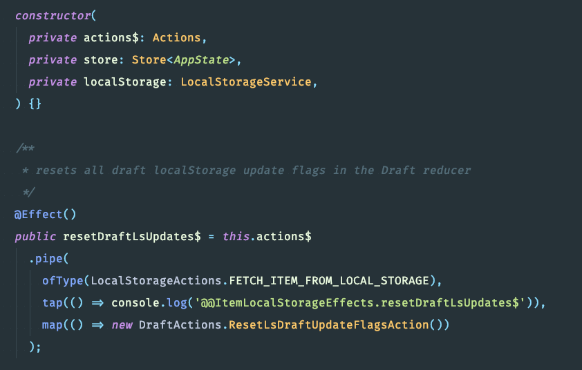

---

[.background-color: #e3f2ea]


^in owa: most of all action -> effects sequences

---

[.background-color: #e3f2ea]


^in owa: auto update (body, to/cc recipients, subject)

---

[.background-color: #e3f2ea]


^in owa: validation, fetch ZIVVER contact details

---

[.background-color: #e3f2ea]


^in owa: conversation, grant token, messages

---

# Redux devtools

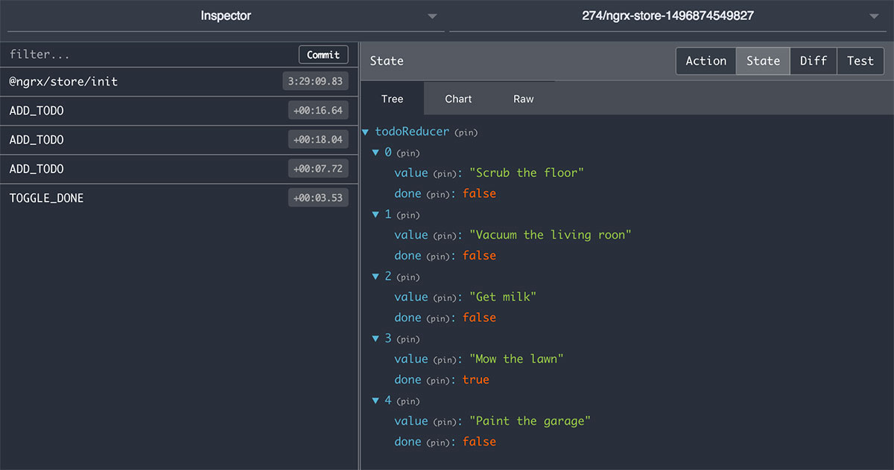

---

# state management (NGRX)

- one source of truth is really nice
- in practice... OWA -> localStorage (proxy @Andrej)

---

# NGRX further reading

- [don't fear the boilerplate](https://codeburst.io/state-management-in-angular-ee2ccb81c283) (interesting read)
- [NGRX testing documentation](https://ngrx.io/guide/store/testing)
- [splitter and aggregator pattern](https://medium.com/default-to-open/angular-splitter-and-aggregation-patterns-for-ngrx-effects-c6f2908edf26)
- [NGRX patterns](https://blog.nrwl.io/ngrx-patterns-and-techniques-f46126e2b1e5)


^dont fear the boilerplate, argues in favour of Andrej's point regarding state management.