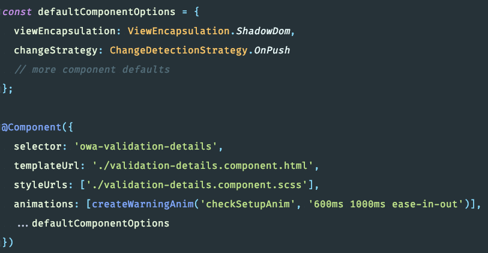
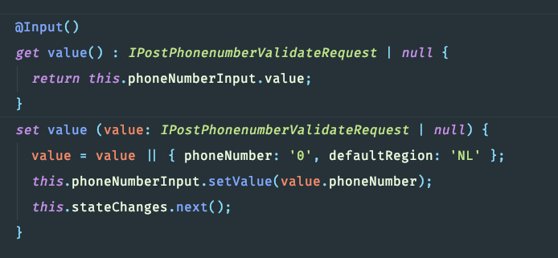

footer: © [@michahell](https://www.twitter.com/michahell) @ [ZIVVER](https://www.zivver.eu)
slidenumbers: true
build-lists: true
theme: Next, 1

# [fit] Sharing our 
# [fit] Angular experiences

### [fit] ... and run-ins
### [fit] with certain caveats 💁💰

---

# overview

### - overall opinion
### - good parts
### - bad parts
### - summary
### - other
### - future Angular

---

# opinion

---

> **pro**: great to work with, a bit verbose, conceptually very much OO with some FRP and immutability mixed in.
-- Michael

---

> **con**: some parts under documentated. Offers a lot, so also big and complex : long learning curve, not steep!
-- Michael

^dynamism gets little attention: generated components / structural directives, delegated forms, etc.

---

> **pro**: full package framework, it has everything you need. Typescript and rxjs makes it more powerful.
-- Sarea

---

> **con**: sometimes it becomes too complex. the syntax makes me feel that it's almost a separate language. RXJS is very powerful, but be careful!
-- Sarea

---

# good parts

### - [click](good-parts.md) ↗

---

# bad parts

### - [click](bad-parts.md) ↗

---

# caveat summary

### - \*ngFor
### - | async  + \*ngLet
### - custom form components
### - view encapsulation
### - RXJS operators, error handling
### - state mgmt best practices

---

## other

### - @Input getter setter
### - component defaults
### - moar articles

---

# component defaults

---

# @Input setter / getter

---

# moar articles

- [Create and Test Decorators in JavaScript – Netanel Basal](https://netbasal.com/create-and-test-decorators-in-javascript-85e8d5cf879c)
- [Provider scope](https://angular.io/guide/providers)

---

# future Angular

### - future: Angular Ivy improvements
### - better treeshaking
### - metaprogramming, mixins, HOC ([article](https://blog.nrwl.io/metaprogramming-higher-order-components-and-mixins-with-angular-ivy-75748fcbc310))

---

# thank you

[https://github.com/michahell/ks-angular](https://github.com/michahell/ks-angular)

**made with** [Deckset](https://www.deckset.com/) (Markdown), [Carbon](https://carbon.now.sh), [StackBlitz](https://stackblitz.com/) and [Figma](https://www.figma.com)

    

